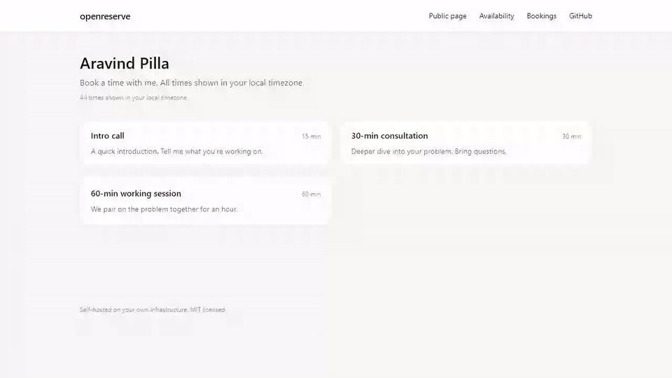
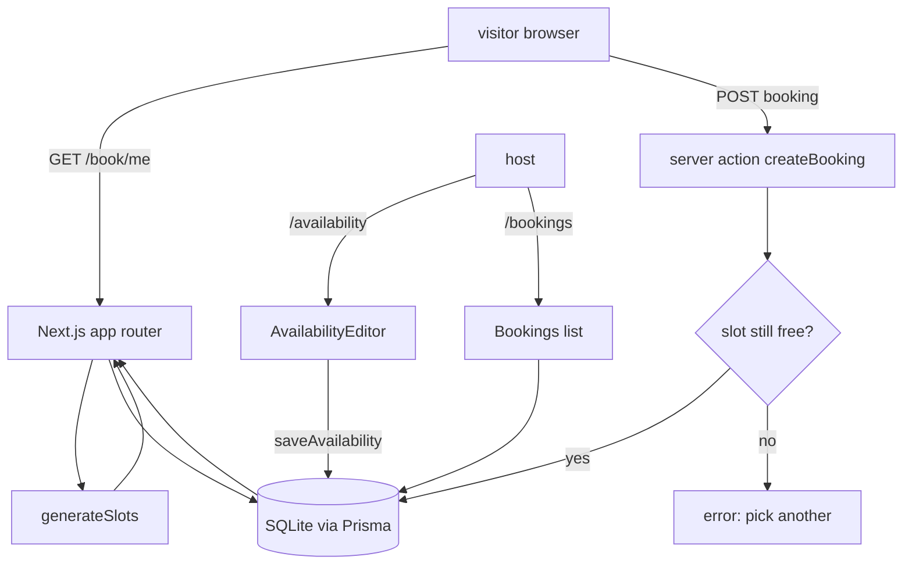

# openreserve

> *Open-source Calendly, self-hosted in 60 seconds.*



<p align="left">
  <a href="https://github.com/krish9219/openreserve/stargazers"></a>
  <a href="https://github.com/krish9219/openreserve/blob/main/LICENSE"></a>
  
  
  
  <a href="https://github.com/krish9219/openreserve/actions"></a>
</p>

A single-host scheduling tool. Set your weekly hours, share one URL, get bookings into a SQLite file. No SaaS, no per-seat fees, no email lock-in, no Postgres to babysit. Built with Next.js 14 + Prisma + Tailwind.

```bash
git clone https://github.com/krish9219/openreserve
cd openreserve
cp .env.example .env       # edit HOST_USERNAME, HOST_NAME, HOST_TIMEZONE
npm install
npm run setup              # prisma db push + seed
npm run dev
# open http://localhost:3000
```

Total install-to-running: about 60 seconds on a warm npm cache.

## What it does

- Public booking page at `/book/<your-username>` — visitors pick from your event types, pick a slot in their own timezone, fill a form, get a confirmation.
- Admin pages at `/availability` and `/bookings` — edit your weekly hours, see who booked what. Single-host, no login (intentional MVP scope — see [Security](#security) before deploying publicly).
- Slot generator that respects buffer minutes and never double-books — the conflict check is enforced at the database write, not just the UI.
- All times stored UTC, rendered in the visitor's local timezone via the browser.

## Architecture



```
app/
  page.tsx                            landing
  book/[username]/page.tsx            event-type list
  book/[username]/[event]/page.tsx    slot picker + booking form (client component)
  availability/page.tsx               weekly-hours editor
  bookings/page.tsx                   upcoming bookings list
lib/
  db.ts                               singleton Prisma client
  availability.ts                     slot generation (timezone-aware)
  availability.test.ts                offline tests for the generator
  actions.ts                          server actions: createBooking, saveAvailability
prisma/
  schema.prisma                       Host / EventType / AvailabilityRule / Booking
  seed.ts                             seeds the configured single host
```

Around 600 lines of TypeScript. You can read it in an afternoon.

## vs. the alternatives

| | openreserve | Cal.com | Calendly | Rallly |
|---|---|---|---|---|
| **Self-hosted by design** | yes | yes | no | yes |
| **Time to first booking** | 60s | ~30 min | ~5 min | ~5 min |
| **Database required** | SQLite (file) | Postgres | n/a (SaaS) | Postgres |
| **Lines of code** | ~600 | ~30k+ | n/a | ~10k+ |
| **Email confirmations** | bring your own | built-in | built-in | built-in |
| **Calendar sync (Google / etc)** | no (by design) | yes | yes | partial |
| **Multi-tenant / team mode** | no | yes | yes | partial |
| **Best for** | one person, one URL | teams | non-technical users | meeting polls |

If you're a team that needs Google sync, Stripe, Zapier, and a dashboard — use **Cal.com**. If you're one person who wants `mydomain.com/book/me` running on a $5 VPS without a SaaS subscription, this is for you.

## How slots are computed

1. Load all `AvailabilityRule` rows for the host (recurring weekly windows in host timezone, stored as minutes-after-midnight).
2. Load all confirmed `Booking` rows that intersect the requested range.
3. For each day in the range, walk every rule that matches the day-of-week. Step from `startMin` to `endMin - durationMin` in `granularityMin` increments.
4. For each candidate slot, convert to UTC, check it doesn't overlap any booking (with optional buffer), and drop slots in the past.

The DB write inside `createBooking` re-checks for conflicts inside a single query before inserting. Two visitors clicking the same slot at the same instant cannot both succeed.

## Configuration

Edit `.env`:

| Variable | Required | Notes |
|---|---|---|
| `DATABASE_URL` | yes | `file:./dev.db` for SQLite; switch to `postgresql://...` and change `provider` in `prisma/schema.prisma` if you want Postgres |
| `HOST_USERNAME` | yes | Public URL slug. `/book/<this>` |
| `HOST_NAME` | yes | Shown to visitors |
| `HOST_TIMEZONE` | yes | IANA name. `Asia/Kolkata`, `America/New_York`, etc |

## Deploy

**Vercel** — works out of the box. Add the env vars; Vercel runs `prisma generate` automatically. Note: Vercel's filesystem is read-only at runtime, so you need a hosted SQLite (Turso) or Postgres for production. Edit `prisma/schema.prisma` accordingly.

**Fly.io / Railway / a VPS** — copy the repo, set env vars, run `npm run setup && npm run build && npm start`. SQLite works fine since the filesystem persists.

**Self-host on a Raspberry Pi** — same as VPS. Use `pm2` or systemd.

## Security

This is a single-host MVP. The `/availability` and `/bookings` admin pages have **no authentication**. Before deploying to a public URL:

- Put the admin routes behind HTTP basic auth at the proxy (nginx, Cloudflare Access, Vercel password protection), OR
- Add NextAuth and gate the admin pages on session.

The public booking flow itself is safe — input is validated server-side with Zod, and bookings are scoped to one host.

## FAQ

**Will it scale past one host?** No, and that's the point. For multi-host, look at Cal.com. The constraint here keeps the surface area small enough to read in an afternoon.

**Why SQLite?** Because at one-host scale, you don't need anything else. Switch to Postgres by changing `provider = "sqlite"` to `"postgresql"` in `prisma/schema.prisma` and updating `DATABASE_URL`.

**Why no calendar sync?** Calendar sync is a maintenance burden — Google OAuth, Outlook OAuth, iCloud quirks. The repo focuses on the interesting code (slot math, conflict-free booking) and leaves integration to downstream forks.

**How do I send confirmation emails?** Edit `lib/actions.ts::createBooking` to call your email provider after the DB insert. ~10 lines of code; intentionally not built in because every provider's SDK is different.

**Is double-booking really impossible?** Two visitors hitting the same `submit` at the exact same millisecond will both pass the in-process check, but only one will win the database write (the second fails the in-transaction conflict query and returns "someone just booked that slot"). The visitor retries the form with a fresh slot list.

**Does it work in production?** Yes for one person taking up to a few hundred bookings per month on a $5 VPS. Beyond that, you'd want connection pooling and probably Postgres.

## Tests

```bash
npm test
```

The slot generator has unit tests covering: in-window slots, conflict exclusion, buffer enforcement, and skipping past slots. They run without a database.

## What's missing (and intentionally so)

- **No email confirmations.** Add a webhook to your own email service in `createBooking` if you need them.
- **No calendar sync** (Google / Outlook / iCloud). The interesting code is the slot math; sync is a maintenance burden.
- **No multi-host / team mode.** Run multiple instances if you need multiple hosts.
- **No payments.** Stripe-link in the event-type description if you want paid bookings.

Each of these is a one-evening addition. The point of the repo is the core scheduling primitive — everything else is glue you write for your own needs.

## Contributing

See [CONTRIBUTING.md](CONTRIBUTING.md). Security: see [SECURITY.md](SECURITY.md).

## Star history

[](https://star-history.com/#krish9219/openreserve&Date)

## License

MIT — see [LICENSE](LICENSE).
